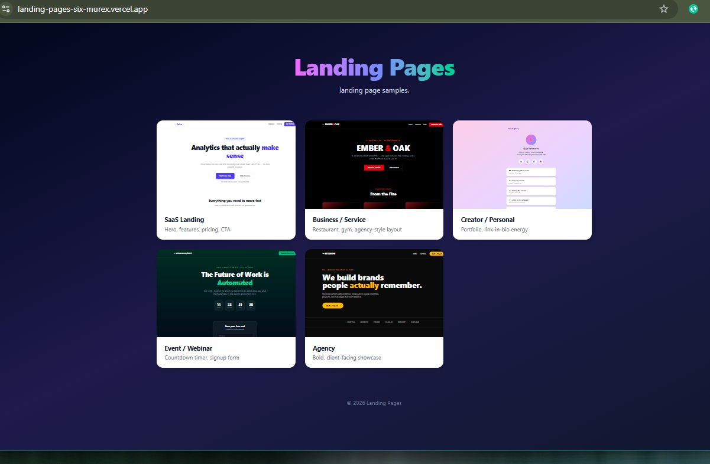

# Landing Pages

A gallery of six distinct landing page styles — different industries, different design languages, all built from scratch in a single React codebase.

**🔗 Live demo:** [landing-pages-six-murex.vercel.app](https://landing-pages-six-murex.vercel.app)



## What's inside

| Page | Style | Route |
|---|---|---|
| SaaS Landing | Hero, features, pricing tiers, CTA | `/saas` |
| Business / Service | Restaurant/steakhouse — menu, testimonials, hours | `/business` |
| Creator / Personal | Link-in-bio, pastel gradient | `/creator` |
| Event / Webinar | Live countdown timer, signup form | `/event` |
| Agency | Bold portfolio, services, client showcase | `/agency` |

The home page (`/`) is a gallery that links to all five, with a live-rendered iframe preview of each.

## Tech stack

- **React 18** + **Vite**
- **Tailwind CSS v4**
- **React Router** for client-side routing
- **Vitest** + **React Testing Library** for smoke tests
- **GitHub Actions** for CI (lint, test, build on every push)
- **Vercel** for deployment

## Running locally

```bash
git clone https://github.com/davidtiger3622/landing-pages.git
cd landing-pages
npm install
npm run dev
```

Visit `http://localhost:5173`.

## Testing

```bash
npm run test
```

12 smoke tests covering all six pages — confirms each renders without crashing and shows its key content.

## Linting

```bash
npm run lint
```

## Building for production

```bash
npm run build
```

## CI/CD

Every push to `main` runs lint, tests, and a production build via GitHub Actions. Deployment to Vercel happens automatically on push.

## Project structure

```
landing-pages/
├── src/
│   ├── pages/
│   │   ├── Home.jsx
│   │   ├── SaasLanding.jsx
│   │   ├── BusinessLanding.jsx
│   │   ├── CreatorLanding.jsx
│   │   ├── EventLanding.jsx
│   │   ├── AgencyLanding.jsx
│   │   ├── NotFound.jsx
│   │   └── __tests__/
│   ├── components/
│   │   └── LandingCard.jsx
│   ├── App.jsx
│   └── main.jsx
├── .github/workflows/ci.yml
└── vercel.json
```

## License

MIT © 2026 David Wanjala Wafula
